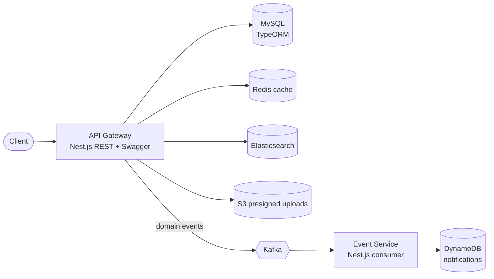

# Yo - Twitter-style Backend in Nest.js Microservices


**Yo** is a production-style backend for a Twitter-like social app. It's built as a Nest.js monorepo with an API gateway and an event service that talk over Kafka, and it covers the things real social platforms need: auth, follows, posts, replies, reposts, likes, search, notifications and media uploads.

---

## ✨ Highlights

- **Microservices monorepo**: `api-gateway` (REST + Swagger) and `event-service` (Kafka consumer), with shared `libs/` for config, Kafka, email, types and utils
- **Event-driven design**: domain events (for example, user created) are published to Kafka so async work stays decoupled from the request path
- **Data layer**: MySQL with TypeORM, versioned migrations, seeders, plus backup and restore scripts
- **Performance**: Redis caching and DataLoader batching to avoid N+1 queries
- **Search**: Elasticsearch-powered search module
- **Notifications**: stored in DynamoDB (see [DYNAMODB_IMPLEMENTATION.md](./DYNAMODB_IMPLEMENTATION.md))
- **Media uploads**: S3 presigned URLs, so clients upload avatars directly to S3
- **Security**: session-based auth guards, bcrypt password hashing, request validation with class-validator
- **Observability**: Datadog tracing via `dd-trace`
- **Quality**: Jest unit tests across controllers, services and guards, plus e2e tests and Compodoc docs
- **CI/CD**: GitHub Actions pipeline that provisions staging with Terraform and ships Docker images to AWS ECR

---

## 🏗️ Architecture



### Avatar upload flow (S3 presigned URL)

1. The backend generates a presigned S3 URL and object key
2. The client uploads the image straight to S3 with a `PUT` request
3. The object key is saved on the user record
4. Avatars are served through signed URLs generated by the backend

---

## 🚀 Getting started

```bash
# install dependencies
npm install

# start MySQL, Kafka, Redis, Elasticsearch and admin UIs
npm run docker:up

# run migrations and seed data
npm run migration:run
npm run db:seed

# start the services in watch mode
npm run start:api-gateway
npm run start:event-service
```

API docs are available at **http://localhost:3000/api** (Swagger).

More detail lives in [readme/GETTING_STARTED.md](./readme/GETTING_STARTED.md) and [readme/MIGRATIONS.md](./readme/MIGRATIONS.md).

### Tests

```bash
npm run test       # unit tests
npm run test:e2e   # end-to-end tests
npm run test:cov   # coverage report
```

---

## 📡 Endpoints

🔒 = auth required · 📃 = paginated

**Auth**
- [x] `POST /auth/login`

**Users**
- [x] `GET /users/@{username}`
- [x] `GET /users/{userid}`
- [x] `POST /users`
- [x] `PATCH /users/{userid}` 🔒
- [x] `PUT /users/{userid}/follow` 🔒
- [x] `DELETE /users/{userid}/follow` 🔒
- [ ] `GET /users` 📃
- [ ] `GET /users/{userid}/followers` 📃
- [ ] `GET /users/{userid}/followees` 📃

**Posts**
- [x] `GET /posts/{postid}`
- [x] `POST /posts` 🔒 (simple posts, replies, reposts and quote posts)
- [x] `DELETE /posts/{postid}` 🔒
- [x] `PUT /posts/{postid}/like` 🔒
- [x] `DELETE /posts/{postid}/like` 🔒
- [x] `GET /posts` 📃 filtered by author
- [ ] `GET /posts` filters for replies, original posts and full-text search
- [ ] #hashtags and @mentions in posts

**Hashtags**
- [ ] `GET /hashtags` 📃
- [ ] `GET /hashtags/{tag}/posts` 📃

---

## 🛠️ Tech stack

Nest.js · TypeScript · TypeORM · MySQL · Kafka (KafkaJS) · Redis (ioredis) · DataLoader · Elasticsearch · DynamoDB · AWS S3 · Swagger · Jest · Docker · Terraform · GitHub Actions · Datadog

---

## 👤 Author

**Mustkeem K**, Senior Full Stack Engineer · [mustkeemk.com](https://mustkeemk.com) · [LinkedIn](https://linkedin.com/in/mustkeemk)

Licensed under the [GNU AGPL v3](./LICENSE.md).
